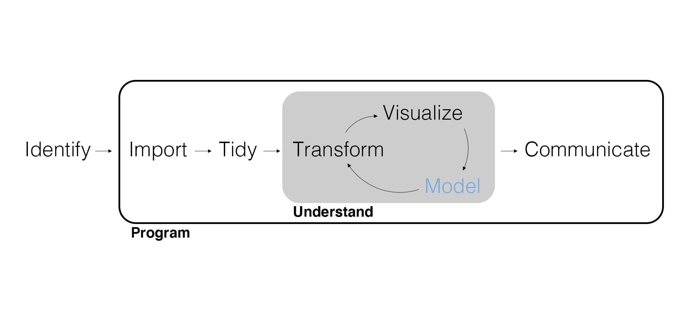

## Marketing Analytics Process

<center>
{width=900px}
</center>

---

{width=500px}

## Inferential Modeling Workflow

<center>
{width=900px}
</center>

## Consider | Consider the Data Generating Process

Remember, your story about the possible *data generating process* is the beginning of a model.

Instead of sales, let's consider what might drive a "top-selling" sales period?

- "Top-selling" is a binary variable.
- Promotions could certainly have an impact.
- The region of the country should matter.
- Anything else?

## Build | Build a Statistical Model

Remember, if a model starts with a story about the data generating process, we translate that story into math and build a statistical model. So far, we've used:

$$y = \beta_0 + \beta_1 x_1 + \beta_2 x_2 + ... + \beta_p x_p + \epsilon, \text{ where } \epsilon \sim Normal(0, 1)$$

- $y$ is the *outcome* variable.
- $x_1$ through $x_p$ are the *explanatory* variables (a.k.a., predictors).
- $\beta_0$ is the *intercept* parameter.
- $\beta_1$ through $\beta_p$ are the *slope* parameters.
- $\epsilon$ is the *error* term.

But what if $y$ is **discrete** rather than continuous?

---

Instead of a *regression* where the outcome is continuous, we need a model for **classification** where the outcome is discrete (specifically binary, where $y$ is zero or one).

Instead of modeling $y$, what if we modeled the probability of $y$?

$$\text{Pr}(y) = \beta_0 + \beta_1 x_1 + \beta_2 x_2 + ... + \beta_p x_p$$

Closer, but still not right.

$$\text{Pr}(y) \in (0, 1)$$
$$\beta_0 + \beta_1 x_1 + \beta_2 x_2 + ... + \beta_p x_p \in (−\infty, \infty)$$

We need to transform the linear model so that it equals a probability.

## Logistic Regression

This resulting classification model is called **logistic regression** (after the function applied to the linear model).

$$
\text{Pr}(y) = {\exp\left(\beta_0 + \beta_1 x_1 + \dotsc + \beta_px_p\right) \over 1 + \exp\left(\beta_0 + \beta_1 x_1 + \dotsc + \beta_px_p\right)}
$$

- $y$ is a *binary* outcome variable.
- $x_1$ through $x_p$ are the *explanatory* variables (a.k.a., predictors).
- $\beta_0$ is the *intercept* parameter.
- $\beta_1$ through $\beta_p$ are the *slope* parameters.

---

A few things to note:

- The error term is part of the probability rather than added on.
- We have the same goal as before: estimate the parameters.
- Logistic regression is also known as **binomial regression** or a **logit model**.
- There are many models that follow this process of transforming a linear model to work with different outcome variables. Altogether they are known as **generalized linear models** (GLMs).
- Logistic regression is the most commonly used GLM.

## Simulate | Simulate Data and Recover Parameters

Remember that we can assume our model *is* the data generating process, *choose* values for the parameters, and generate or *simulate* data using the model. Why?

1. Prepare our data analysis before getting real data.
2. Prove our code is working by recovering parameter values.
3. Investigate potential problems with the data.

---

Load packages and simulate data using a logistic regression.

$$
\text{Pr}(y) = {\exp\left(\beta_0 + \beta_1 x_1 + \dotsc + \beta_px_p\right) \over 1 + \exp\left(\beta_0 + \beta_1 x_1 + \dotsc + \beta_px_p\right)}
$$

```{r include=FALSE}
# Load packages.
library(tidyverse)
library(tidymodels)
```

```{r}
set.seed(42)    # Set the randomization seed.
n <- 500        # Number of observations.
beta0 <- -1.30  # Intercept parameter.
beta1 <- 0.25   # Slope parameter for promotion spend.
beta2 <- 1.20   # Slope parameter for cold region.

# Simulate data.
sim_data <- tibble(
  x1 = runif(n, min = 0, max = 10),
  x2 = rbinom(n, size = 1, prob = 0.30),
  prob_y = exp(beta0 + beta1 * x1 + beta2 * x2) / 
    (1 + exp(beta0 + beta1 * x1 + beta2 * x2)),
  y = rbinom(n, size = 1, prob = prob_y) |> factor()
)
```

---

```{r}
sim_data
```

---

Can we recover parameters? Remember that `beta0 = -1.30`, `beta1 = 0.25`, and `beta2 = 1.20`.

```{r}
# Fit a logistic regression.
sim_fit <- logistic_reg() |> 
  set_engine(engine = "glm") |> 
  fit(y ~ x1 + x2, data = sim_data)

# Tidy output.
tidy(sim_fit, conf.int = TRUE)
```

## Preprocess | Preprocess Data for Modeling

Remember, we often need to *preprocess the data* to model it or to make it easier for the model to use.

```{r message=FALSE}
# Import soup data.
soup_data <- read_csv(here::here("Data", "soup_data.csv")) |> 
  mutate(top_selling = if_else(Sales > 20000, 1, 0) |> factor())

# Split data.
soup_split <- initial_time_split(soup_data, prop = 0.90)
```

---

Remember, using a recipe allows us to apply our preprocessing steps to whatever data we'd like.

```{r}
# Prepare a preprocessing recipe.
soup_recipe <- training(soup_split) |> 
  recipe(top_selling ~ Any_Price_Decr_Spend + Retailer_Trade_Areas) |> 
  step_log(all_numeric(), offset = 1) |> 
  step_dummy(Retailer_Trade_Areas) |> 
  prep()

# Apply the recipe to the training and testing data.
soup_training <- soup_recipe |>
  bake(training(soup_split))

soup_testing <- soup_recipe |>
  bake(testing(soup_split))
```

## Fit | Specify the Model Type and Engine and Fit

Remember, we specify the model and engine and fit the model. When we *fit* the model (a.k.a., training, calibrating, or estimating the model) we are getting parameter estimates.

```{r}
# Fit a logistic regression.
fit <- logistic_reg() |> 
  set_engine("glm") |> 
  fit(top_selling ~ ., data = soup_training)
```

## Evaluate | Parameter Estimates, Significance, and Predictive Fit

Remember, our goal is to use the model to *estimate* the unobserved parameters from the data. In other words, parameter estimates are the information we are extracting from the data to inform our managerial decision.

```{r eval=FALSE}
# Compare parameter estimates.
tidy(fit, conf.int = TRUE) |> 
  ggplot(aes(y = term)) + 
  geom_point(aes(x = estimate)) + 
  geom_errorbarh(aes(xmin = conf.low, xmax = conf.high), height = .1) +
  geom_vline(xintercept = 0, color = "red")
```

---

```{r echo=FALSE}
# Compare parameter estimates.
tidy(fit, conf.int = TRUE) |> 
  ggplot(aes(y = term)) + 
  geom_point(aes(x = estimate)) + 
  geom_errorbarh(aes(xmin = conf.low, xmax = conf.high), height = .1) +
  geom_vline(xintercept = 0, color = "red")
```

---

```{r}
# What about interpreting the parameter estimates?
tidy(fit, conf.int = TRUE)
```

Each $\beta$ represents the expected change in the **log-odds** of "success" (getting a one in the binary outcome) for a one-unit increase in the value of X, holding all other variables fixed (relative to the baseline level if discrete).

---

$$
\text{Pr}(\text{top_selling}) = {\exp\left(-6.74 + 0.75 \times \text{Any_Price_Decr_Spend} + \ldots \right) \over 1 + \exp\left(-6.74 + 0.75 \times \text{Any_Price_Decr_Spend} + \ldots \right)}
$$

Use $plogis(\beta)$ to obtain the expected change in *probability* of success relative to a baseline level of 0 for all other predictors (including the intercept!)

---

```{r}
# Interpreting the parameter estimates as probabilities.
tidy(fit, conf.int = TRUE) |> 
  mutate(
    estimate = plogis(estimate),
    conf.low = plogis(conf.low),
    conf.high = plogis(conf.high)
  )
```


## Why is the probability interpretation so weird?

Unfortunately, we don't have an 'easy' interpretation of the coefficients' effects on the probability of success. Why?

<center>

{width=600px}

<center>

---

Remember that instead of measuring how well a model fits the *data*, we should measure how well a model *predicts*. This predictive fit doesn't have the same risk of overfitting.

Instead of RMSE, we will compute the **accuracy** of the logistic regression. Once again, closer to 1 is better.

```{r}
# Compute model accuracy.
fit |> 
  predict(new_data = soup_testing, opts = list(threshold = 0.3))|>
  bind_cols(soup_testing) |>
  accuracy(truth = top_selling, estimate = .pred_class)
```

Compute model accuracy with a custom threshold.

```{r}
threshold <- 0.6

# Compute model accuracy.
fit |> 
  predict(new_data = soup_testing, type = "prob") |>
  bind_cols(soup_testing) |>
  mutate(pred_y = if_else(.pred_1 >= threshold, 1, 0) |> factor()) |>
  accuracy(truth = top_selling, estimate = pred_y)
```


---

Accuracy can also be summarized using a **confusion matrix**.

```{r}
# Confusion matrix.
fit |> 
  predict(new_data = soup_testing) |>
  bind_cols(soup_testing) |>
  conf_mat(truth = top_selling, estimate = .pred_class)
```

## Predict | Counterfactual Predictions

Once we have a best-fitting model, we want to predict **counterfactuals**. A counterfactual is a prediction of what will happen if we intervene in the process in a certain way.

```{r}
# Column names, type, and preprocessing needs to match the recipe.
scenarios <- tibble(
  # generate spend on price decreases using 4 values from 0 to 10,000
  # repeat those spend values 4 times, one repetition for each trade area
  Any_Price_Decr_Spend = seq(from = 0, to = 10000, by = 10000 / 3) |> rep(4),
  # generate the trade areas, repeat 4 times for each value of spend on price decreases
  Retailer_Trade_Areas = unique(soup_data$Retailer_Trade_Areas) |> rep(4) |> sort(),
  top_selling = factor(1)
)
```

---

Remember to remove the outcome (and any superfluous explanatory variables) from `new_data` before using it in `predict()`.

```{r}
# Apply the recipe to the training data.
scenarios <- soup_recipe |>
  bake(scenarios) |> 
  select(-top_selling)

scenarios
```

---

Instead of predicting binary outcomes, we can also predict the probability of success.

```{r}
# Predict success (no prediction intervals).
predict(fit, new_data = scenarios, type = "prob") |> 
  bind_cols(scenarios) |> 
  mutate(Any_Price_Decr_Spend = exp(Any_Price_Decr_Spend)) |> 
  arrange(desc(.pred_1))
```

## Wrapping Up

*Summary*

- One last review of the inferential modeling workflow.
- Discussed the differences between regression and classification.
- Extended regression to a binary discrete outcome with logistic regression.

*Next Time*

- Project week.

## Exercise 14

Return one last time to `soup_data` and the models from the previous exercises.

1. Create a discrete outcome variable `top_selling` based on `Sales > 375000` using `if_else()` and `factor()`.
2. Preprocess the data using `initial_time_split()` with just 75% of the data in training and fit the same models again using the preprocessed training data, now as logistic regressions with the new `top_selling` variable as the outcome variable. *You can ignore any warnings when fitting each model.*
3. Compute the accuracy using the preprocessed testing data. Is the same model as last time the best-fitting model again?
4. Compute a confusion matrix for the best-fitting model and accurately interpret it.
5. Render the Quarto document into Word and upload to Canvas.

